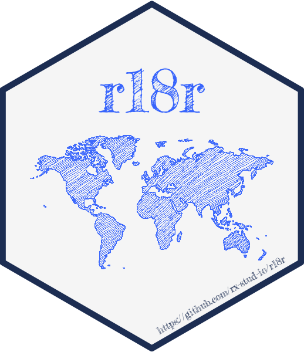

# r18r 

This is an R package to help translating other packages - with heavy focus on marking terms in a package for translation along with comments for the translators.

## Why the name?

`i18n` is the standard shorthand for internationalization (starting with "i", having 18 chars and then ending with "n"), but it sounds like an Apple product, and an R package really needs many more R letters .. so we changed both the starting and ending letters to "r". And did you know which is the 18th letter of the English alphabet? Right, it's "R".

How to pronounce? Well, as per above, "rrr" sounds tempting, but since the "1" in the logo looks like the letter "l" and "8" can be read out as "ate", "r18r" should be pronounced just like the English "relator" word: "a person who relates or tells; narrator".

## Install

Since the `r18r` package  has been just open-sourced and we are still finishing up the API changes due to generalization of the already existing internal features, it is currently only available on GitHub, and can be installed via the `remotes` package:

```r
library(remotes)
install_github('rx-stud-io/r18r')
```

## Quick demo

Load the package:

```r
library(r18r)
```

Load the PO files of the package:

```r
translations_import(po_folder('r18r'), 'r18r')
```

Set the default language to be used in future translations:

```r
translate_set_language('en', 'r18r')
```

Translate a term:

```r
translate('Text to be translated', ns = 'r18r')
```

## Using `r18r` in other packages

1. Use the `translatable` or `T` helpers to mark terms in your package to be translated.
2. Run `translations_generate` to extract the above terms and generate your POT and PO files.
3. Run `translations_import` to import your PO files into an `r18r` namespace (default to using your package name as the `ns`) and pick a default language with `translate_set_language` as part of your `.onLoad` function.
4. Use the `translate` function in your package to return messages in the supported languages, generate localized plots etc.

For an example implementation, check out the `r18r.example` package's `zzz.R` file for init and `example.R` for a translation call.

## Acknowledgements

This package was heavily inspired by previous work of others, so expressing my gratitude to

* Michael Chirico for `potools` and driving the recent translation efforts around R, including the awesome [tutorial at useR! 2021](https://contributor.r-project.org/translating-r-to-your-language/).
* Michael Lawrence for maintaining and managing [translations in R Core](https://translation.r-project.org/).
* Heather Turner and Saranjeet Kaur for the Collaboration Campfires series on "Learn how to contribute to R!", including the overview on R's process for localization and "How to Contribute to a Translation Team".
* The authors of the `hexSticker` R package, [vecteezy.com](https://www.vecteezy.com/vector-art/3001221-freehand-world-map-sketch-on-white-background), and Tart Workshop for their contributions to the hex logo of the package.
* [Rx Studio Inc.](https://rx.studio) for sponsoring the internal development and the open-sourcing efforts of this project.
